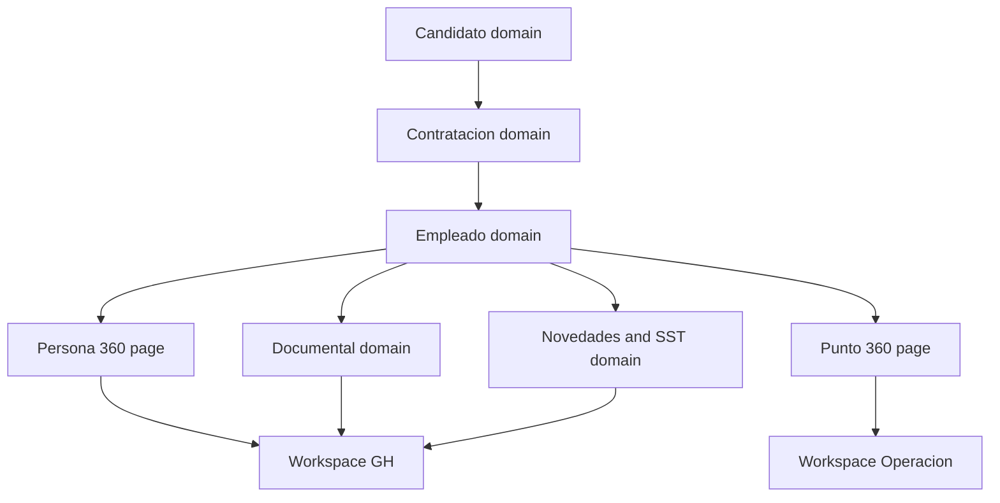

# HubGH Wave 1 Design

## 1. Objective

Establish the Sprint 1 governance baseline for HubGH with no behavioral regression, preserving the current DocType to Page to Workspace architecture while formalizing:

1. Core entity ownership and lifecycle boundaries
2. Permission governance by role and information dimension
3. Shared catalog ownership and change control
4. Reuse vs extend vs create decisions for impacted DocTypes

Primary architecture references:

- [`HubGH Orchestrated Plan v1`](../plans/hubgh-8-sprint-orchestrated-plan-v1.md)
- [`Arquitectura HubGH`](./arquitectura-hubgh.md)
- [`Guía de diseño de bandejas operativas`](../plans/guia-diseno-bandejas-operativas.md)

## 2. Scope

### In scope

1. Governance contracts for entities, permissions, catalogs, and DocType strategy
2. Backward-compatible decisions for existing flows:
   - Candidate onboarding and document intake
   - Persona 360
   - Punto 360
   - Existing bandejas and operational trays
3. Explicit non-regression constraints to protect current production behavior

### Out of scope

1. Runtime code implementation and schema migrations
2. Endpoint signature changes
3. Workspace restructuring that alters current role visibility behavior
4. UI redesign beyond baseline alignment to existing bandeja design tokens and layout conventions

## 3. Entity master map draft aligned to current architecture

Architecture principle remains unchanged:

`DocTypes -> Pages -> Workspaces -> Roles`

### 3.1 Core entities and ownership

| Entity | Current anchor DocType or artifact | Owner area | Lifecycle stage | Notes |
|---|---|---|---|---|
| Candidate intake | `Candidato`, `Candidato Documento`, `Candidato Disponibilidad` | HR Selection | Prospect to approved or rejected | Public onboarding remains source for intake |
| Hiring packet | `Datos Contratacion`, `Contrato`, `Afiliacion Seguridad Social` | HR Labor Relations | Approved candidate to linked employee | Must remain additive and traceable |
| Employee master | `Ficha Empleado` | Gestión Humana | Active workforce lifecycle | Canonical person record after handoff |
| Point master | `Punto de Venta` | Operación with GH governance | Operational assignment lifecycle | Punto 360 depends on stable keys |
| Document domain | `Document Type`, `Document Type Area`, `Person Document`, `Persona Documento`, `Operacion Tipo Documento` | Shared GH governance | Versioned by person and area | Unification governance without breaking existing retrieval paths |
| Labor events | `Novedad Laboral`, `GH Novedad` | GH and Operación | Time-bound state events | Must preserve active headcount semantics |
| SST domain | `Caso SST`, `SST Alerta`, `SST Seguimiento` | HR SST | Occupational health lifecycle | Clinical and operational views remain partitioned |
| RRLL domain | `Caso Disciplinario` | HR Labor Relations | Case intake to formal decision | Closure requires explicit decision contract |
| Wellbeing signals | `Feedback Punto`, `Comentario Bienestar` | HR Training and Wellbeing | Follow-up cycles | Read models feed Persona and Punto views |

### 3.2 Page and workspace coupling baseline

| Layer | Existing artifacts to preserve | Governance rule |
|---|---|---|
| Pages | `persona_360`, `punto_360`, `bandeja_contratacion`, `bandeja_afiliaciones`, `seleccion_documentos`, `sst_bandeja` | Preserve page route names and existing response contracts |
| Workspaces | GH, Operación, Mi perfil | Preserve visibility semantics through transitional role aliases |
| Roles and aliases | Canonical and transitional aliases from current role matrix | Additive role normalization only, no abrupt legacy lockout |

## 4. Permission matrix by role and information dimension

Dimensions:

- D1 Personal core data
- D2 Contracting and affiliations
- D3 Documentary files and metadata
- D4 Disciplinary and legal traces
- D5 SST clinical-sensitive data
- D6 Operational point KPIs
- D7 Publishing and policy communications

Permission key: N none, R read, W write, M manage create or update or delete.

| Role canonical | D1 | D2 | D3 | D4 | D5 | D6 | D7 | Baseline compatibility rule |
|---|---|---|---|---|---|---|---|---|
| Gestión Humana | M | M | M | R | R | R | M | Keeps current broad access envelope |
| HR Selection | M candidate scope | R pre-contract scope | M candidate docs | N | N | R limited | N | No expansion beyond selection boundaries |
| HR Labor Relations | R | M | R or M by case | M | R limited | R | N | RRLL remains final authority for labor decisions |
| HR SST | R operational | R when required | R SST docs | N | M clinical | R risk signals | N | Clinical details never exposed to non-SST roles |
| HR Training and Wellbeing | R | N | R wellbeing docs | N | R non-clinical | M wellbeing KPIs | M GH policy scope | Keep Persona and Punto feeds additive |
| GH - Bandeja General | R | R | R | N | N | R | N | Triaging only, no hidden escalation privileges |
| GH - RRLL | R | R | R case attached | M | N | R | N | Bounded to RRLL workflows |
| GH - SST | R | N | R SST attached | N | R non-clinical | R | N | No clinical mutation rights |
| Jefe_PDV | R limited | N | R required ops docs | N | R impact-only | M local KPI and novedades intake | N | Must preserve operational bandeja behavior |
| Empleado | R self | N | R self | N | R self impact-only | R self context | R announcements | No desk-level management grants |
| Candidato | R self onboarding | N | M self candidate docs | N | N | N | N | Public onboarding and document upload unchanged |
| System Manager | M | M | M | M | M | M | M | Platform override remains unchanged |

## 5. Shared catalog governance rules

### 5.1 Catalog families

1. Identity and civil data catalogs
2. Contracting and social security catalogs
3. Documentary type catalogs
4. Novedad and state taxonomy catalogs
5. SST and compliance status catalogs
6. Operational classification catalogs for point context

### 5.2 Governance rules

1. Single owner per catalog with named backup owner
2. Changes are additive by default; destructive changes require deprecation window
3. Every catalog entry must include status active or deprecated and effective date
4. Catalog labels may evolve, catalog keys must remain stable
5. Cross-module catalog reuse is preferred over duplicated local lists
6. Any catalog used in bandejas must preserve badge semantics and status color compatibility with the existing bandeja design baseline
7. If a catalog value affects filtering in Persona 360 or Punto 360, include regression verification in Sprint gate checklist

## 6. DocType decision table reuse vs extend vs create

| Domain need | Existing DocType or artifact | Decision | Rationale | Guardrail |
|---|---|---|---|---|
| Candidate intake and documents | `Candidato`, `Candidato Documento`, `Candidato Disponibilidad` | Reuse and extend additive fields only | Already anchors onboarding and candidate docs | Keep `create_candidate` response and onboarding flow stable |
| Hiring handoff packet | `Datos Contratacion`, `Contrato`, `Afiliacion Seguridad Social` | Reuse and extend | Existing handoff surface is active | Preserve current bandeja contracting and affiliation actions |
| Employee canonical record | `Ficha Empleado` | Reuse | Canonical employee source in current architecture | Do not alter current key semantics consumed by 360 pages |
| Point operational context | `Punto de Venta` | Reuse | Existing Punto 360 dependency | Keep active headcount criteria unchanged |
| Documentary governance | `Document Type`, `Document Type Area`, `Person Document`, `Persona Documento`, `Operacion Tipo Documento` | Reuse with unification policy and optional bridge fields | Current dual paths require governance, not hard replacement in Sprint 1 | Maintain all existing retrieval endpoints and page consumers |
| Labor state events | `Novedad Laboral`, `GH Novedad` | Reuse with taxonomy harmonization | Existing event logic already active in 360 contexts | Keep temporary vs definitive state behavior unchanged |
| RRLL case flow | `Caso Disciplinario` | Reuse and extend workflow metadata | Existing base exists | No closure without explicit decision metadata |
| SST longitudinal flow | `Caso SST`, `SST Alerta`, `SST Seguimiento` | Reuse | Existing SST pages and alerts already operational | Preserve confidentiality partitioning |
| Wellbeing follow-up | `Feedback Punto`, `Comentario Bienestar` | Reuse and extend additive fields | Existing signal capture present | Maintain query compatibility in Persona and Punto views |
| New governance registry for Sprint 1 | No single explicit registry currently | Create `GH Governance Registry` only if required in Sprint 2 plus | Avoid unnecessary schema churn in Sprint 1 | Prefer documentation contracts first |

## 7. Non-regression constraints for current modules

### 7.1 Onboarding

1. Public onboarding candidate creation remains available with existing anti-abuse controls
2. Candidate document upload flow remains functional and route-compatible
3. Duplicate prevention and rate limiting behavior remains intact

### 7.2 Persona 360

1. Existing page route and load behavior remain unchanged
2. Existing timeline and summary blocks keep current response contract
3. Any new dimensions must be additive and permission-gated

### 7.3 Punto 360

1. Existing page route and filters remain unchanged
2. Active headcount logic remains strict to active employee state semantics
3. Drilldown entry points to related records remain stable

### 7.4 Bandejas

1. Existing tray actions and endpoint signatures remain unchanged
2. Visual consistency follows the established baseline in the bandeja design guide
3. New statuses or badges must map to existing semantic tones and not break operator interpretation

## 8. Sprint 1 design acceptance checklist

- [ ] Entity ownership and lifecycle mapped for all core domains
- [ ] Role by dimension permission matrix approved
- [ ] Shared catalog governance rules validated by GH owner roles
- [ ] DocType decision table validated against current architecture constraints
- [ ] Non-regression constraints explicitly linked to onboarding, Persona 360, Punto 360, and bandejas

