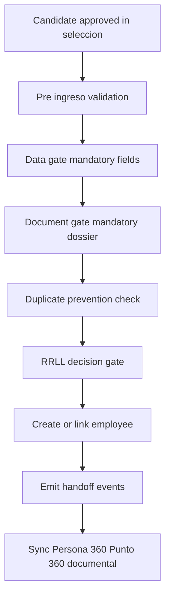

# HubGH Wave 2 Design

## 1. Objective

Deliver Sprint 2 as a backward-compatible candidate to employee handoff hardening wave, making **RRLL** the final authority for formal ingreso while preserving current onboarding, selección, afiliaciones, contratación, and existing endpoint signatures.

Primary references:

- [`HubGH Orchestrated Plan v1`](../plans/hubgh-8-sprint-orchestrated-plan-v1.md)
- [`Guía de diseño de bandejas operativas`](../plans/guia-diseno-bandejas-operativas.md)
- [`HubGH Wave 1 Design`](./hubgh-wave-1-design.md)

## 2. Scope

### In scope

1. Formal ingreso flow contract with RRLL as final authority
2. Mandatory data and document gate before employee creation or linkage
3. Duplicate-prevention strategy and deterministic identity checks
4. Candidate to employee lineage model and event traceability contract
5. Integration contracts for Persona 360, Punto 360, and documentary layer
6. Explicit non-regression constraints for selección, afiliaciones, contratación, and endpoint stability

### Out of scope

1. Breaking route or API signature changes
2. Workflow redesign unrelated to candidate handoff
3. Full documentary unification beyond Sprint 2 handoff needs

## 3. Formal handoff flow with RRLL final authority

### 3.1 Authority and transition rules

1. Selection can prepare candidate status for ingreso readiness but cannot finalize ingreso.
2. RRLL performs the final decision action that authorizes employee creation or linkage.
3. If RRLL rejects at gate, candidate remains traceable and no employee record is created.
4. All transitions are append-only in audit terms and must preserve existing timeline visibility behavior.

## 4. Mandatory data and document gate

### 4.1 Minimum data contract

Required minimum fields before RRLL approval:

1. Candidate unique identity fields used by existing onboarding and contracting surfaces
2. Hiring-critical fields consumed by contratación and afiliaciones
3. Assignment context required for downstream Persona 360 and Punto 360 read models

Rule: validation is additive and non-breaking. Existing payload keys remain unchanged; only stricter preconditions are introduced at the handoff gate.

### 4.2 Mandatory document contract

1. Candidate dossier must include required document types defined for ingreso readiness.
2. Missing mandatory documents block RRLL finalization.
3. Documentary metadata must remain compatible with current retrieval and upload paths.
4. Version semantics: latest valid evidence is used for handoff decisions while preserving historical attachments.

## 5. Duplicate-prevention strategy

### 5.1 Deterministic duplicate checks

1. Exact identifier match check against employee master keys
2. Candidate already-linked check to prevent repeated conversion
3. Ongoing handoff lock check to prevent parallel conversion races

### 5.2 Outcome contract

1. **No duplicate found**: allow RRLL decision to proceed
2. **Existing employee match**: link candidate to existing employee lineage, no new employee creation
3. **Ambiguous conflict**: block auto handoff, route to RRLL resolution with explicit reason code

## 6. Candidate to employee lineage model

### 6.1 Canonical lineage entities

1. Candidate origin record remains immutable as intake source
2. Employee record is canonical workforce record after handoff
3. Handoff link entity or fields provide permanent `candidate_id -> employee_id` lineage mapping

### 6.2 Lineage invariants

1. Every handoff-approved employee must reference origin candidate
2. A candidate may map to zero or one canonical employee in Sprint 2 scope
3. Link creation must be idempotent under retry and safe under concurrent execution

## 7. Event traceability contract

### 7.1 Event envelope

Each handoff event must persist:

1. Event key and event type
2. Candidate id and employee id if already assigned
3. Actor and authority role
4. Decision result and reason code
5. Timestamp and correlation id
6. Source module and endpoint signature version marker

### 7.2 Required Sprint 2 events

1. `handoff.validation_started`
2. `handoff.data_gate_passed` or `handoff.data_gate_failed`
3. `handoff.document_gate_passed` or `handoff.document_gate_failed`
4. `handoff.duplicate_check_passed` or `handoff.duplicate_check_blocked`
5. `handoff.rrll_approved` or `handoff.rrll_rejected`
6. `handoff.employee_created` or `handoff.employee_linked`
7. `handoff.published_to_360`

## 8. Integration impact contracts

### 8.1 Persona 360

1. Ingreso event appears in timeline using normalized event envelope
2. Candidate-origin trace is visible as contextual provenance for authorized roles
3. Existing Persona 360 route and response shape remain unchanged

### 8.2 Punto 360

1. Employee linkage and assignment context become available after approved handoff
2. No change to current active headcount semantics
3. Existing Punto 360 route and filters remain stable

### 8.3 Documentary layer

1. Candidate dossier references are preserved and linked to employee documentary context
2. No disruption to current candidate upload and retrieval endpoints
3. Historical document lineage remains queryable for audit

### 8.4 Bandejas and visual consistency

Any Sprint 2 UI touchpoint for handoff status in bandejas must align with [`Guía de diseño de bandejas operativas`](../plans/guia-diseno-bandejas-operativas.md) by reusing:

1. `window.hubghBandejasUI`
2. Base classes such as `hubgh-card`, `hubgh-badge`, and `hubgh-actions`
3. Existing indicator semantics for ready pending blocked outcomes

## 9. Non-regression constraints

### 9.1 Selección

1. Candidate intake and progression behavior stays intact
2. Existing selection actions remain valid with unchanged signatures

### 9.2 Afiliaciones

1. Current affiliation bandeja behavior remains unchanged
2. Handoff only tightens preconditions, not endpoint contracts

### 9.3 Contratación

1. Existing contract creation path for approved candidates remains valid
2. Existing contracting endpoint signatures remain unchanged

### 9.4 Signature and compatibility guards

1. No breaking changes to endpoint names, request keys, or response envelopes
2. Additive fields only, backward-compatible defaults required
3. Any new status value must not break current client-side filters

## 10. Sprint 2 design acceptance checklist

- [ ] RRLL final authority is explicit in the formal flow contract
- [ ] Mandatory data and document gates are defined with blocking criteria
- [ ] Duplicate-prevention decision matrix is defined and deterministic
- [ ] Candidate to employee lineage invariants are documented
- [ ] Event traceability envelope and required events are listed
- [ ] Persona 360 Punto 360 documentary integration impacts are defined
- [ ] Non-regression constraints explicitly protect selección afiliaciones contratación and endpoint signatures

